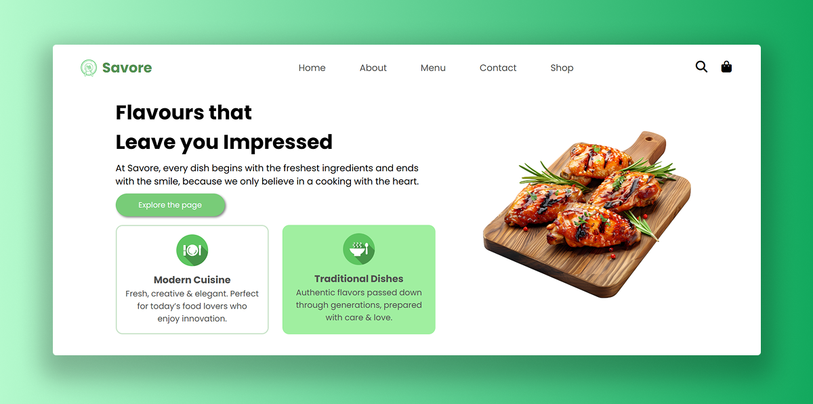

# Savore Site
Savore is a fully responsive **restaurant website** with multiple sections, built entirely using **HTML and CSS**.   

 

### 🔗 Explore the project live [here](https://savoresite.vercel.app).  

## Overview
- Designed and built a complete restaurant layout including intro section, about info, menu preview, popular dishes, special offers, testimonials, and footer.  
- Used CSS variables for consistent colors and theme across the site.  
- Used Flexbox and CSS Grid to build responsive websites that adapt across different screen sizes. 

